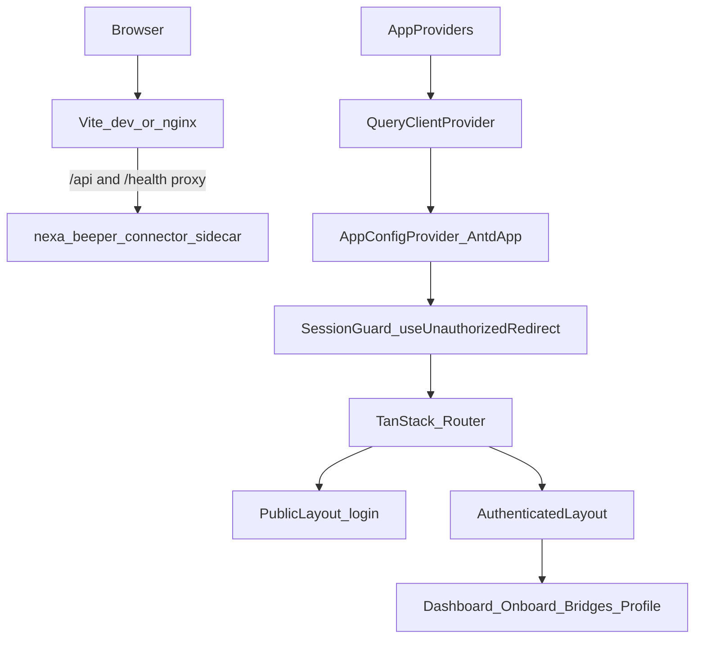

# Nexa Portal — Handover Document

**Audience:** Engineers taking over development, review, or cutover of the rebuilt web UI.  
**Repo path (local):** `W:\Freelanceing\Designer Bros\Nexa\nexa-portal`  
**Package name:** `@nexa/monorepo` / app `@nexa/nexa-portal`  
**Branch of recent UI work:** `sekar-development` (commit includes shell, dashboard AG Grid, onboard redesign, black dark mode, ecom-style toasts)  
**Related backend (frozen):** `nexa-beeper-connector-main`  
**Legacy UI reference (read-only):** `Nexa-FrontEnd-main` / remote [codzofrosh/Nexa-FrontEnd](https://github.com/codzofrosh/Nexa-FrontEnd)

---

## 1. What this project is

Nexa Portal is a **UI-layer rebuild** of the Nexa web SPA on the same architectural patterns as the CRM / ecom-v2 portal:

| Layer | Choice |
| ----- | ------ |
| UI | React 19, Ant Design 6, Tailwind 4 |
| Routing | TanStack Router (code-based route tree) |
| Server state | TanStack Query 5 |
| Client state | Zustand |
| Forms | React Hook Form + Zod |
| Tables (recent messages) | AG Grid Community + Enterprise 35 |
| Workspace | pnpm + Nx + Vite |
| Test | Vitest + Testing Library, Playwright, MSW |

**Governing constraint:** do not change the business layer. The FastAPI sidecar and bridges stay frozen. The portal must call the **same endpoints**, with the **same bodies, order, and poll cadences** as the legacy SPA. Improvements go in [`deferred-proposals.md`](./deferred-proposals.md), not silent product changes.

Read [`.cursor/rules/nexa.md`](../.cursor/rules/nexa.md) before changing code.

---

## 2. Documentation map (read in this order)

| Document | When to read |
| -------- | ------------ |
| This file (`docs/handover.md`) | First-day orientation and current UI state |
| [`../README.md`](../README.md) | Install, scripts, env table |
| [`api-contract.md`](./api-contract.md) | Allowed HTTP surface |
| [`screen-inventory.md`](./screen-inventory.md) | Parity baseline / acceptance criteria |
| [`access-control-analysis.md`](./access-control-analysis.md) | Auth, cookies, what the client may / may not claim |
| [`deferred-proposals.md`](./deferred-proposals.md) | Known bugs and improvements parked on purpose |
| [`cutover-runbook.md`](./cutover-runbook.md) | Side-by-side network parity + go/no-go |
| [`mobile-readiness.md`](./mobile-readiness.md) | Rules for `libs/core` and future React Native |

---

## 3. Repository layout

```
nexa-portal/
├── apps/nexa-portal/          # Web app: routes, shell, feature slices, MSW, e2e
├── apps/nexa-mobile/          # Expo RN client (Bearer session after DP-009)
├── libs/core/                 # Platform-neutral (RN reuse): contract, data, auth, schemas, tokens, util
├── libs/web/                  # Web-only: axios/cookies, Ant Design theme, shared-ui
├── docs/                      # Contract, inventory, cutover, this handover
├── e2e/                       # Playwright
└── .cursor/rules/nexa.md      # Always-on agent / contributor rules
```

| Package | Role |
| ------- | ---- |
| `@nexa/contract` | Endpoint paths + request/response types |
| `@nexa/data` | HttpClient port, APIs, query options, `extractApiError` |
| `@nexa/auth` | Session store, AuthStrategy / KeyValueStore ports |
| `@nexa/schemas` | Zod schemas |
| `@nexa/tokens` | Palettes (incl. black dark palette), spacing, typography |
| `@nexa/util` | Formatters (`senderHandle`, `truncate`, timestamps) |
| `@nexa/platform-web` | axios client, cookie auth, localStorage, env |
| `@nexa/theme-web` | `buildAntdTheme` |
| `@nexa/shared-ui` | `App*` primitives, form fields, `useToast`, `useConfirm`, providers |
| `@nexa/nexa-mobile` | Expo app: Paper UI, React Navigation, fetch + TokenAuthStrategy |

**Composition roots (only places platform is wired):**  
- Web: `apps/nexa-portal/src/app/composition-root.ts`  
- Mobile: `apps/nexa-mobile/src/app/composition-root.ts`  

Feature code must import `@nexa/data` / `@nexa/auth`, never platform modules directly.  
Mobile runbook + parity checklist: `apps/nexa-mobile/README.md`, `apps/nexa-mobile/docs/parity-checklist.md`.

---

## 4. Runtime architecture



### Provider chain

`apps/nexa-portal/src/app/app-providers.tsx`:

1. `QueryClientProvider`
2. `AppConfigProvider` (theme + Ant Design `App` for notifications/modals)
3. `SessionGuard` → `useUnauthorizedRedirect` (must sit **under** AntdApp so toasts work)
4. `RouterProvider`

### Auth session

- Cookie session via `CookieAuthStrategy`
- Cold load: `rehydrateSession()` → `GET /api/auth/me` once (root `beforeLoad`)
- 401 mid-session: window event → clear store/cache → warning toast → `/login`
- Logout: `POST /api/auth/logout` (failures still clear local state; soft warning toast)

### Routing (authenticated)

| Path | Feature |
| ---- | ------- |
| `/login` | Public login / register + OAuth |
| `/app/dashboard` | Stats + recent messages |
| `/app/onboard/whatsapp` | WhatsApp QR onboarding |
| `/app/bridges` | WhatsApp + LinkedIn bridge cards |
| `/app/profile` | Profile page |
| `/app/appearance` | Appearance (theme) page — still routed; primary toggle is in header |

Nav labels/order (sidebar): Dashboard → WhatsApp → Bridges  
(`apps/nexa-portal/src/app/layouts/nav-items.ts`)

---

## 5. Feature handover (current UI)

### 5.1 Auth / login

- **Files:** `features/auth/**`
- Form-first layout; OAuth after the form
- Submit errors stay **inline**; success uses `toast.success('Signed in successfully')`
- Blank phone omitted from register body (parity)
- OAuth = full-page navigation to `/api/auth/oauth/{provider}/start`, not XHR

### 5.2 Shell (authenticated)

- **Files:** `app/layouts/authenticated-layout.tsx`, `authenticated-sidebar.tsx`, `authenticated-layout-header.tsx`, `app-footer.tsx`, `global-theme-styles.tsx`
- Ecom-style: fixed sider (~220px), header (theme toggle + profile drawer + logout confirm), footer
- Sidebar logo: `/nexa-logo.png`; dark mode brand bar black + logo `filter: invert(1)` for white wordmark
- Profile opens a right drawer (`features/profile/components/profile-drawer.tsx`)
- Logout uses centered `useConfirm`, then `useLogout`

### 5.3 Dashboard

- **Files:** `features/dashboard/**`
- Header **Refresh** refetches stats + recent messages (`useDashboard().refetch`)
- KPI cards (clickable filters scroll to recent messages)
- Twin breakdown panels: priority + classifier
- Recent messages: **AG Grid** (`recent-messages-table.tsx`)
  - Modules: `AllCommunityModule` + `AllEnterpriseModule`
  - Columns: Sender, Content, Platform, Classification, Time
  - Features: sort/filter/floating filter, sidebar Columns/Filters, cell selection, context-menu CSV/Excel, pagination
  - Theme: Quartz + `colorSchemeDark` / `colorSchemeLight` from resolved mode
- **Network (must stay):** `GET /api/stats` + `GET /api/messages/recent?limit=10`
- Fetch failures still degrade to zero/empty (no error toast) for legacy parity

### 5.4 Onboard (WhatsApp)

- **Files:** `features/onboard/**`
- Full-width twin layout: “How it works” + action panel (QR / form / result)
- Phases: `idle` → `scanning` → `connected` | `error`
- Polls: status every 3s, QR every 18s; **no poll at t=0** after start (parity)
- Connected / error: toast **and** inline Result / danger text
- Cancel / connected: `DELETE` session; navigate away mid-scan does **not** DELETE (DP-010)

### 5.5 Bridges

- **Files:** `features/bridges/**`
- Cards for WhatsApp + LinkedIn only
- Disconnect: immediate POST logout + toast success/error; inline message kept
- Confirm-before-disconnect is **DP-003** (not shipped)
- LinkedIn Connect still has no real onboard route (**DP-001**)

### 5.6 Theme / dark mode

- Store: `features/theme/stores/app-config.store.ts` (persisted)
- Toggle: header `ThemeModeToggle`
- Dark palette: black base (`#000000`), chrome `#0a0a0a` — not slate-blue
- Builder: `libs/web/theme/src/theme-builder.ts` + `libs/core/tokens/src/palette.ts`
- Sidebar Menu/Sider theme follows `resolvedMode`

### 5.7 Toasts

- Hook: `libs/web/ui/src/hooks/use-toast.ts` (ecom-aligned API)
  - `toast.success/error/info/warning(body, options?)`
  - Ant Design **Notification** via `App.useApp()`
  - Defaults: duration 3s, closable, `topRight` / `top` on mobile
- Wired for: login success, bridge disconnect, onboard connected/error, session expiry, logout API failure
- **Never** use static `message` / `notification` from `antd`

---

## 6. Getting started (day one)

### Prerequisites

- Node ≥ 20
- pnpm `10.28.1` (see README if `corepack` needs Admin on Windows)

### Install & run

```bash
cd nexa-portal
pnpm install

# Default: Vite on :3000, proxy /api → sidecar
pnpm dev

# MSW only (no sidecar)
pnpm dev --mode mock
# or use committed .env.development with VITE_API_MODE=mock
```

### Sidecar ports (common footgun)

| How you run the sidecar | Set `NEXA_SIDECAR_URL` |
| ----------------------- | --------------------- |
| docker-compose (default) | `http://localhost:8080` |
| `python sidecar/main.py` | `http://localhost:8000` via `.env.local` |

Empty `VITE_API_URL` is intentional (same-origin + cookie session).

### Useful scripts

| Command | Purpose |
| ------- | ------- |
| `pnpm typecheck` | App TS |
| `pnpm typecheck:core` | Core without DOM |
| `pnpm lint` | ESLint + Nx boundaries (`nx show projects` first) |
| `pnpm test` / `pnpm test:web` / `pnpm test:core` | Vitest |
| `pnpm test:e2e` | Playwright (mock build) |
| `pnpm storybook` | shared-ui Storybook |
| `pnpm build` | Production build |

---

## 7. Testing expectations

- **Parity tests** assert **full** request sequences via `startRequestLog` + MSW (`onUnhandledRequest: 'error'`).
- Feature hooks that call `useToast` must wrap with `AppConfigProvider` in tests (see onboard / bridges tests).
- Dashboard AG Grid tests: prefer `waitFor` for filtered rows; enterprise may log a trial license watermark in stderr (no license key configured yet).
- Cutover still needs a **manual** DevTools side-by-side against the real sidecar — see [`cutover-runbook.md`](./cutover-runbook.md).

---

## 8. Deployment & git status

### Deploy model (unchanged intent)

- Multi-stage Docker → nginx static + `/api` proxy to backend
- CI target image historically: `ghcr.io/codzofrosh/nexa-frontend:latest`
- Connector `docker-compose` should not need path changes if the image tag stays the same

### Git (as of this handover)

| Item | Value |
| ---- | ----- |
| Local root | `nexa-portal` (not the parent `Nexa/` folder) |
| Working branch | `sekar-development` |
| Remote `origin` | `https://github.com/codzofrosh/Nexa-FrontEnd.git` |
| Push status | **Blocked 403** for GitHub user `SekarNagarajan07` (needs write access or a fork) |

After access is granted:

```powershell
cd "W:\Freelanceing\Designer Bros\Nexa\nexa-portal"
git push -u origin sekar-development
```

**Structural note:** remote `Nexa-FrontEnd` currently hosts the **legacy** Vite SPA layout. This monorepo is a different tree. Pushing `sekar-development` publishes the rebuild on a branch; merging to `main` needs an explicit cutover decision and CI/Docker path review.

---

## 9. What was recently delivered (UI track)

Use this as the changelog for `sekar-development` work:

1. **Authenticated shell** — ecom-style sidebar/header/footer; profile drawer; centered logout confirm  
2. **Dashboard** — KPI cards, breakdown panels, Refresh, AG Grid recent messages (enterprise modules / sidebar)  
3. **Onboard** — full-width dual panel, phase-aware steps, action icons  
4. **Dark mode** — black-based tokens; shell + AG Grid + logo invert  
5. **Toasts** — ecom `useToast` API; SessionGuard nesting; feature + shell call sites  

Commit message used locally:

```
feat: nexa-portal shell, dashboard, onboard, dark mode, and toasts

Port ecom-style layout, notifications, and black-based dark theme.
```

---

## 10. Known gaps / next decisions

Track details in [`deferred-proposals.md`](./deferred-proposals.md). Highest-visibility items:

| ID | Topic | Status vs UI track |
| -- | ----- | ------------------ |
| DP-001 | LinkedIn onboard route | Still deferred (mobile mirrors web dead-end) |
| DP-003 | Confirm before bridge disconnect | Still deferred (mobile: no confirm, same as web) |
| DP-007 | AG Grid (was “don’t add”) | **Superseded in practice** — Grid is shipped for recent messages; update/close proposal when accepting |
| DP-009 | Bearer token for mobile | **Done** — sidecar + `apps/nexa-mobile` |
| DP-010 | Cancel session on unmount | Still deferred (parity; mobile also skips DELETE on navigate away) |
| — | Native OAuth deep link | Stubbed (“use web”); email/password ships |
| — | AG Grid Enterprise license | Trial watermark until key configured |
| — | GitHub write for `SekarNagarajan07` | Required to publish `sekar-development` |

Also decide with product/owner:

- Whether `classifier_breakdown` display is formally accepted (was DP-004)
- When/how to replace legacy `main` + GHCR image with the monorepo build

---

## 11. Day-one checklist for the next engineer

1. Read Rule 0 in `.cursor/rules/nexa.md` and skim `screen-inventory.md`.  
2. `pnpm install` → `pnpm dev --mode mock` → walk login, dashboard, onboard, bridges.  
3. Toggle light/dark; confirm shell, grid, and toasts.  
4. Run `pnpm test:web` and `pnpm typecheck`.  
5. Point at a real sidecar and spot-check network vs cutover runbook.  
6. Mobile: `pnpm android` (AVD + sidecar on 8080); walk `apps/nexa-mobile/docs/parity-checklist.md`.  
7. Resolve GitHub push access or fork strategy for `sekar-development`.  
8. Prefer one feature slice per PR; park improvements in deferred proposals.

---

## 12. Contacts / ownership (fill in)

| Role | Name | Notes |
| ---- | ---- | ----- |
| UI rebuild (this branch) | Sekar Nagarajan | Local `sekar-development` |
| Repo owner (GitHub) | codzofrosh | Must grant write or accept fork PR |
| Backend / sidecar | — | Frozen for migration |
| Product / cutover sign-off | — | Cutover runbook go/no-go |

---

*End of handover. Prefer updating this file when shell, toast, or grid contracts change, and keep deep parity detail in the specialized docs linked above.*
